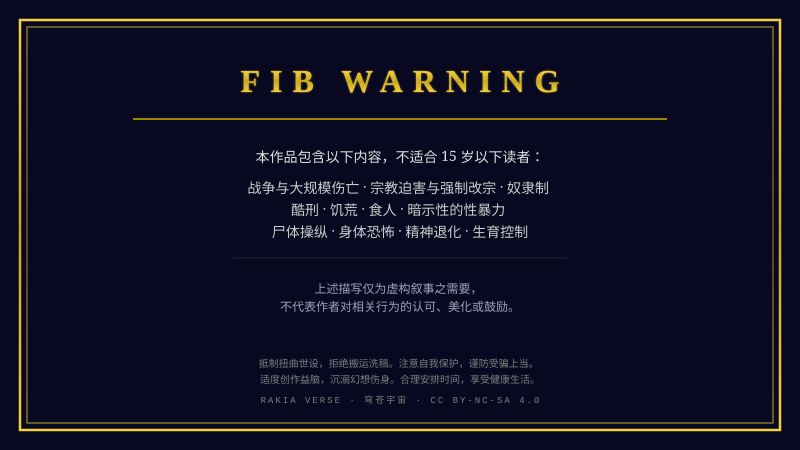

= RAKIA-VERSE

穹苍宇宙世界观设定集。

== FIB WARNING

仓库内容包含对以下主题的虚构描写或讨论：战争与大规模伤亡、宗教迫害与强制改宗、奴隶制、酷刑、饥荒、食人、暗示性的性暴力、尸体操纵、身体恐怖、精神退化以及生育控制。这些描写仅为虚构叙事之需要，不代表作者对相关行为的认可、美化或鼓励。

== 内容

穹苍宇宙（Rakia Verse）是一个世界构建项目，设定在一个平坦、有限的世界之上，头顶是无限的天穹。其名称源自希伯来语 רקיע（raqia），意为“苍穹”。该设定包含多个智慧种族、多样的魔法体系，以及基于艾什尔里偶因论的形而上学。

内容以相互链接的 XML 文档结构组织，使用 `XInclude` 引用。

- 正典内容: link:rakia-verse.xml[rakia-verse.xml]
- 草稿、废案及娱乐向内容：link:src/_/underlined.xml[underlined.xml]
- 维护脚本：link:scripts/scripts.xml[scripts.xml]

== 许可证

- 设定集内容：link:LICENSE[CC-BY-NC-SA 4.0]
- 脚本代码：link:LICENSE-BSD3[BSD 3-Clause License]
